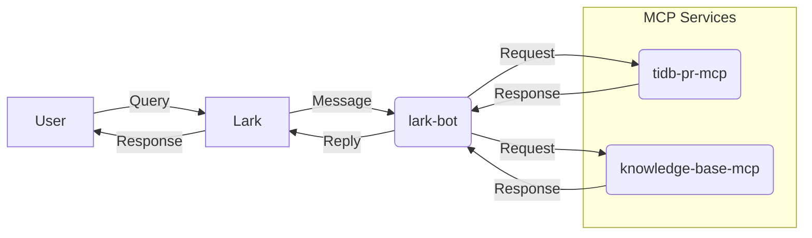
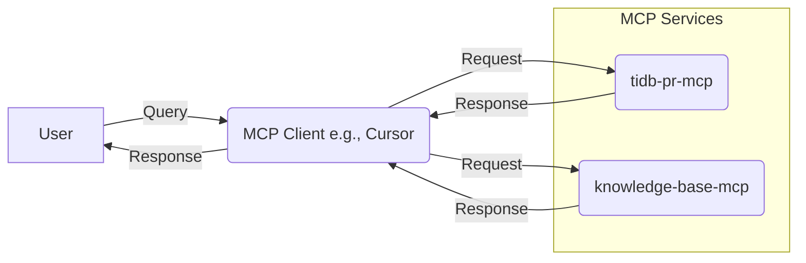

# TiAssistant

PingCAP's 10th Anniversary Internal Hackathon Project

## Overview

TiAssistant is an AI-powered efficiency tool designed to assist TiDB developers by streamlining access to information regarding Pull Requests (PRs) and frequently asked questions (FAQs). It leverages the Model Control Protocol (MCP) architecture to integrate various services and clients.

## Problem Solved

This project aims to reduce the time developers spend on:
- Checking the status, details, and reviewer information of TiDB Pull Requests.
- Searching for answers to common technical questions within the existing knowledge base.

## How it Works

The system consists of two primary MCP services implemented in Python and a Lark bot client implemented in Go:

1.  **`tidb-pr-mcp`**: Analyzes GitHub PRs within TiDB repositories to provide status, labels, details, and reviewer information.
2.  **`knowledge-base-mcp`**: Performs semantic search over a knowledge base (currently Markdown files). It uses [TiDB Vector](https://docs.pingcap.com/tidbcloud/vector-search-overview) for storing and retrieving document embeddings. This component also includes `tidb-vector-ui`, a web tool for document processing.
3.  **`lark-bot`**: Acts as an MCP client, allowing users to interact with the MCP services through the Lark messaging platform.

## Architecture Diagrams

### Lark Bot Interaction Flow

### Direct MCP Client Interaction Flow (e.g., Cursor)

## Components

-   **[`tidb-pr-mcp/`](./tidb-pr-mcp/README.md)**: Python MCP service for TiDB PR analysis.
-   **[`knowledge-base-mcp/`](./knowledge-base-mcp/README.md)**: Python MCP service for knowledge base Q&A using [TiDB Vector](https://docs.pingcap.com/tidbcloud/vector-search-overview).
    -   Includes `tidb-vector-ui` for web-based document management.
-   **[`lark-bot/`](./lark-bot/README.md)**: Go-based Lark bot MCP client. (Note: Add a README for lark-bot if it doesn't exist)

## Getting Started / Usage

The primary way to interact with the TiAssistant system is through the Lark bot. Please refer to the `lark-bot/README.md` for setup and usage instructions.

The individual MCP services can also be run standalone or integrated with other MCP clients (see Extensibility). Refer to their respective README files for details.

## Extensibility

The MCP architecture allows for flexible integration:

-   **Additional Clients**: The `tidb-pr-mcp` and `knowledge-base-mcp` services can be connected to other MCP-compatible clients. See the respective service READMEs for basic integration steps (e.g., command and working directory). For detailed client-specific setup:
    -   **Cursor IDE**: See [Cursor MCP Configuration](https://docs.cursor.com/context/model-context-protocol#configuring-mcp-servers).
    -   **Chatwise**: See [Chatwise MCP Tools](https://docs.chatwise.app/tools.html#tools-mcp).
    -   **Cherry Studio**: See [Cherry Studio MCP Tools](https://docs.cherry-ai.com/advanced-basic/mcp).
-   **Additional Services**: The `lark-bot` can be extended to communicate with other MCP services beyond the ones included in this project.
-   **Discover More MCP Servers**: Explore a wide range of community-contributed MCP servers at [awesome-mcp-servers](https://github.com/punkpeye/awesome-mcp-servers).

## License

This project is licensed under the Apache License 2.0.
